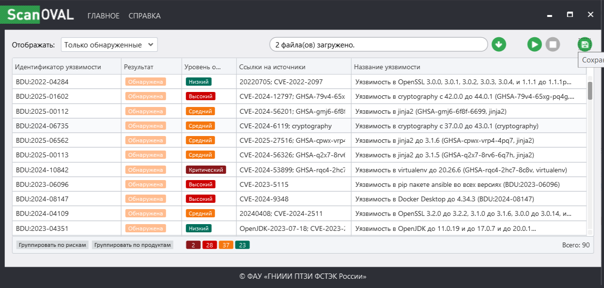
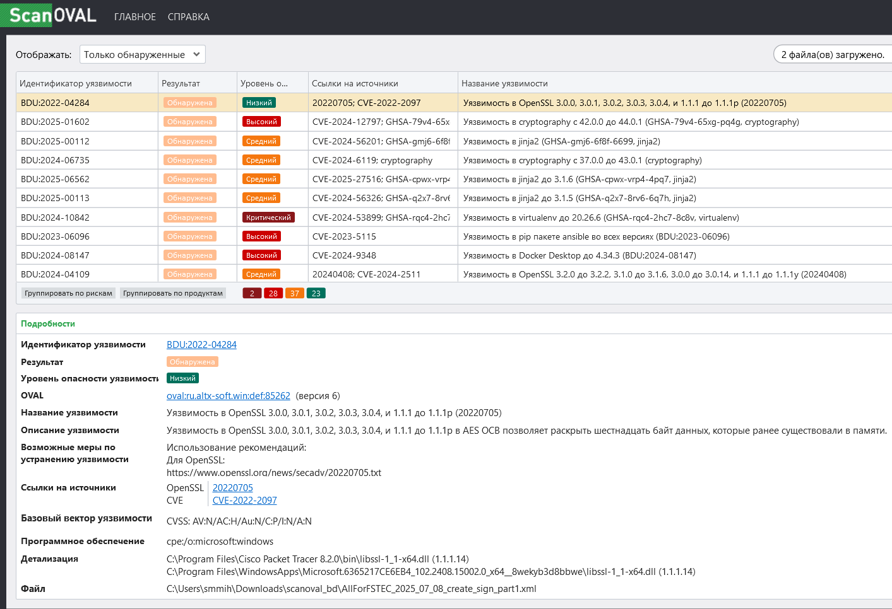
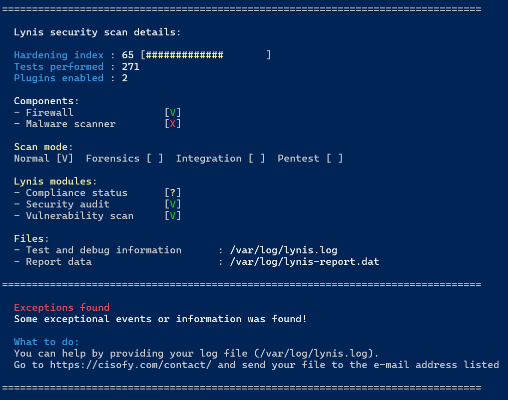
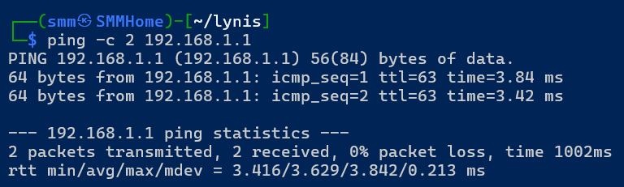
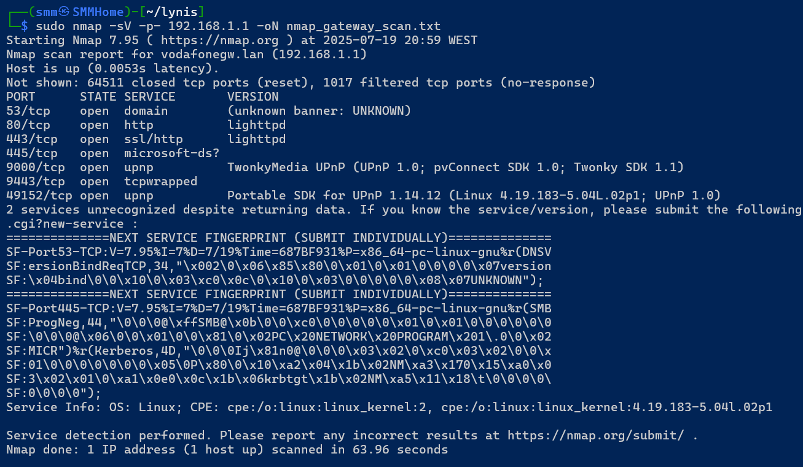
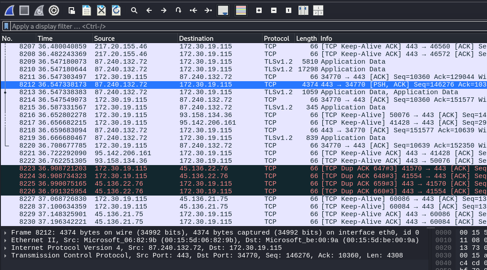

# Домашнее задание к занятию «Работа с инструментами аналитика информационной безопасности» Михалёв Сергей.

### Цель задания

Аналитик информационной безопасности оценивает безопасность системы и настраивает её. В этом домашнем задании вы познакомитесь с инструментами разведки компонентов и командной строки в Astra Linux и Windows. Научитесь настраивать безопасность сетевых устройств.

------

### Задание 1.  Исследование локальных индикаторов

1. Чтобы провести аудит безопасности системы, вам необходимо установить специальное программное обеспечение:
- если у вас установлена Windows OS, зайдите на сайт ФСТЭК России и скачайте программное обеспечение [ScanOVAL](https://bdu.fstec.ru/files/scanoval.msi) и [базу уязвимостей](https://bdu.fstec.ru/files/scanoval.xml). В случае возникновения вопросов по программному обеспечению воспользуйтесь [инструкцией по эксплуатации оператором программного обеспечения](https://bdu.fstec.ru/files/documents/scanoval_manual.pdf);
- если у вас установлен Linux OS, скачайте [Lynis](https://cisofy.com/lynis/#installation), база уязвимостей включена в ПО.
4. Проведите аудит системы по примеру из лекции.
5. Какие уязвимости вы нашли — их точно будет не менее 5. Какие рекомендации вы можете дать по их устранению?
6. Сделайте выводы по степени защищённости операционной системы. 

### Решение.

Для начала воспользовался Утилитой **ScanOVAL**.

Вывод по защищённости на основании анализа полученного файла статистики:
* Выявлено: несколько критических уязвимостей, включая RCE и LPE.
* Угроза: особенно опасны уязвимости в Win32k и Secure Boot, используемые в реальных атаках.
* Без обновлений — система уязвима и может быть скомпрометирована.

Далее для мониторинга виртуальной машины на Kali-Linx использовал утилиту **Lynis**.

Результаты сканирования Lunis сохраняет в файлы: 
* Лог: */var/log/lynis.log* — подробный журнал всех проверок.
* Отчёт: */var/log/lynis-report.dat* — агрегированный отчет с предупреждениями, предложениями и индексом безопасности.

Результат проверки: Hardening index: 65/100- ниже желаемого уровня для систем, подключенных к сети или использующих чувствительные данные. Очевидно есть к чему стремиться.

------

### Задание 2. Исследование сетевых индикаторов

1. Скачайте и установите программное обеспечение [nmap](https://nmap.org/) (zenmap).
2. Проведите анализ точки доступа, установленной у вас дома. Для этого определите адрес шлюза по умолчанию командой `ipconfig` для Windows и `ip route` для Linux. 
3. Выполните проверку доступности шлюза по умолчанию командой ping:
`ping ‘ip address default gate’` (например, `ping 192.168.0.1`).
4. Запустите программу nmap (zenmap) и выполните команду `nmap -sV ‘ip  address default gate’ -p-`. Здесь `‘ip  address default gate’` — `ping 192.168.0.1` из примера выше.
5. Дайте ответ на следующие вопросы:
- Кто производитель оборудования?
- Какая операционная система установлена на устройстве?
- Сколько портов открыто на устройстве?
- Какие сервисы доступны? 
- Есть ли опасные сервисы? Как узнать: скопируйте название службы и её версию, проверьте в поисковой системе.
6. Сделайте выводы по степени защищённости вашего устройства. 

### Решение.

1. Проверку доступности шлюза по умолчанию командой ping.

2. Провёл проверку при помощи nmap.

Отвечаю на вопросы:
- Кто производитель оборудования? *vodafone* (напрямую не читается, но *Nmap scan report for vodafonegw.lan*)
- Какая операционная система установлена на устройстве? *Service Info: OS: Linux*
- Сколько портов открыто на устройстве? *7*
- Какие сервисы доступны? 

| Port      | State | Service       | 
|-----------|-------|---------------|
| 53/tcp    | open  | domain        |
| 80/tcp    | open  | http          | 
| 443/tcp   | open  | ssl/http      | 
| 445/tcp   | open  | microsoft-ds? |  
| 9000/tcp  | open  | upnp          |
| 9443/tcp  | open  | tcpwrapped    |   
| 49152/tcp | open  | upnp          |      

- Есть ли опасные сервисы? Как узнать: скопируйте название службы и её версию, проверьте в поисковой системе. *Думаю, да:*
    * *Port 445 / SMB*
    * *UPnP (9000, 49152): очень часто используется в атаках*
    * *DNS (53) используется для перенаправления трафика*

-----

### Задание 3. Анализ сетевого трафика (задание со * повышенной сложности)

1. Установите [Wireshark](https://www.wireshark.org/). Инструмент понадобится для сбора сетевого трафика и последующего его анализа. 
2. После установки Wireshark перезапустите систему.
3. После перезагрузки в начале работы запустите Wireshark.
4. Включите сбор информации через сетевой интерфейс и приступите к работе.
5. Зайдите на любые сайты, посмотрите различные ресурсы. Собирайте информацию не более 5 минут, после чего отключите сбор информации и сохраните лог пакетов.
6. При работе с Wireshark опирайтесь на [инструкцию](https://www.wireshark.org/docs/wsug_html_chunked/ChapterWork.html#ChWorkViewPacketsSection). 
7. Приступите к анализу:
- Какие пакеты генерируются в вашей сети?
- Что вы можете сказать о содержимом пакетов?
- Какая подозрительная информация вам встречалась?
8. Сделайте выводы.

### Решение.

Произвёл захват трафика с интерфейса eth0.

- Какие пакеты генерируются в вашей сети? *В основном: TCP, TLSv1.3 и UDP*
- Что вы можете сказать о содержимом пакетов? *Так как используется HTTPS протокол, то все данные шифруются.* 
- Какая подозрительная информация вам встречалась? *QUIC трафик (UDP 443) не является вредоносным сам по себе*.